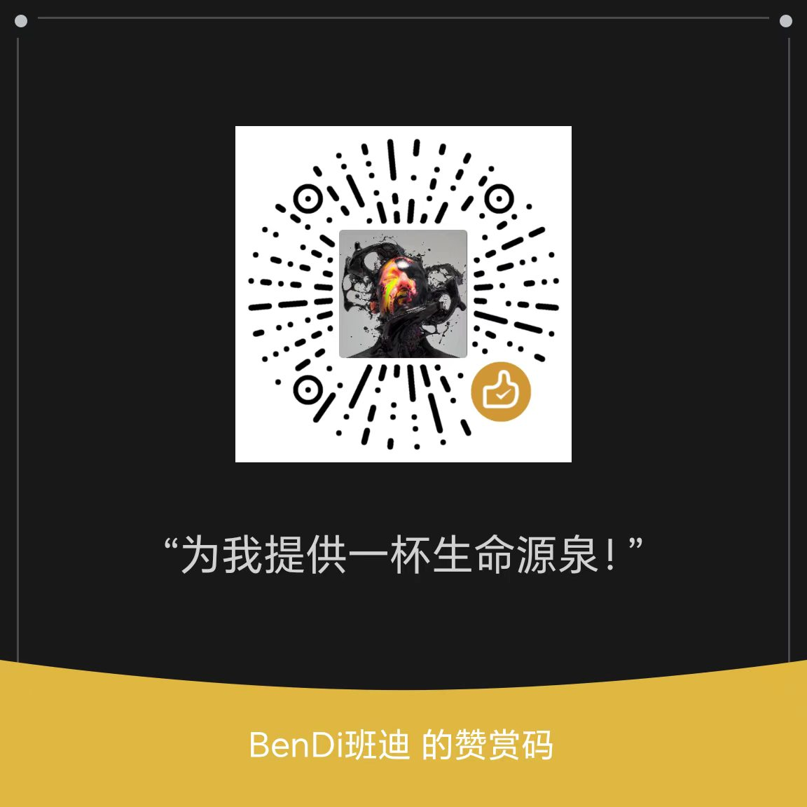

<h1 align="center">🏗️ 班迪 AI 技能库</h1>

<p align="center"><b>BANDY AI SKILLS</b> · 影视与内容创作 AI 技能合集</p>

<p align="center">多技能商业开源仓库 · 由班迪创作系统 (Bandy Creation System) 维护</p>

<p align="center">
<a href="./LICENSE"></a>


<a href="./CONTRIBUTING.md"></a>
</p>

> **纯本地 · 纯文本 · 可移植到任何智能体**
>
> 不锁定平台、不依赖 API、不需要授权码——你的工作流永远属于你自己。

---

## 🏆 赞助商 · Sponsors

| 🥇 首席赞助 | 🥈 联合赞助 | 🥉 支持赞助 |
| :-: | :-: | :-: |
| BenTV | **空缺待招** | **空缺待招** |
| 自研3D白膜导演台 | Logo + 链接 | Logo |

> 成为赞助商,在仓库顶部获得展示位。合作请联系微信(见文末)。

---

## ✨ 特性 · Features

| 分类 | 能力 |
|------|------|
| 🎬 影视前制资产 | 场景图 / 定妆三视图 / 色卡 / 调度图 一键产出 |
| ✍️ 自动创作引擎 | 大纲 → 逐集写作 → 专家评审 → 质量飞轮 |
| 🖼️ 场景细节图 | 场景资产拆分图(全景/微距/空间三行网格) |
| 🎥 导演视听语言 | 文学剧本 → AI 视频可执行 Prompt |
| 🤖 多智能体协作 | 12 位 AI 专家多轮讨论,迭代到完美 |
| 🔌 纯文本指令 | 不绑定任何平台,任意智能体可运行 |
| 🗓️ 定时自动化 | 配合定时任务,全自动批量产出 |
| 📦 零依赖零成本 | 无需 API Key,无需授权码 |

---

## 📦 技能 · Skills

| 技能 | 能力 | 状态 |
|------|------|:----:|
| **bendi-vido** · 班迪一键成片 | 剧本 → 影视前制全套资产(场景参考图 / 角色定妆三视图 / 色卡 / 场景总调度图)+ 2 分钟以上长视频分镜生成 | ✅ |
| **auto-drama-writing** · 短剧自动写作引擎 | 小说/短剧端到端自动创作:大纲生成、逐集自动写作、12 位 AI 专家多轮协作评审、质量飞轮迭代、全局一致性检查、定时续写 | ✅ |
| **班底场景细节图 V1** | 场景 + 风格 → 3:4 三行网格资产拆分图提示词(全景 / 微距 / 空间),一张图集齐场景资产总览 | ✅ |
| **班迪作家系统 V1** | 小说/剧本自动化创作系统,与写作引擎协同,批量产出与精修 | ✅ |
| **班迪导演视听语言 V3.1** | 文学剧本 → AI 视频可执行中文 Prompt;无限风格生成器,任意风格动态拆解;支持局部修改协议 | ✅ |

> 🚧 更多技能(分镜助手、宣发物料生成等)开发中,陆续入驻。

---

## 🚀 快速开始 · Quick Start

**第 1 步**:将技能目录放入智能体的用户级技能目录:

```bash
# Linux / macOS
mkdir -p ~/.workbuddy/skills
cp -r skills/bendi-vido ~/.workbuddy/skills/

# Windows
# 将 skills/ 下技能复制到 C:\Users\<你的用户名>\.workbuddy\skills\
```

**第 2 步**:在对话中调用技能:

```
/bendi-vido               # 一键成片全流程
/auto-drama-writing       # 短剧自动定时写作
/班底场景细节图            # 场景资产拆分图
/班迪作家系统              # 小说/剧本创作
/班迪导演视听语言          # 文学剧本 → 视频 Prompt
```

每个技能均自带完整流程指令,详见各技能目录内 `SKILL.md`。

---

## 🧩 仓库结构 · Structure

```text
bandy-ai-skills/
├── skills/                  # 技能本体(每个技能独立目录,可独立分发)
│   ├── bendi-vido/          # 🎬 一键成片
│   ├── auto-drama-writing/  # ✍️ 自动写作引擎
│   ├── 班底场景细节图V1/     # 🖼️ 场景资产图
│   ├── 班迪作家系统V1/       # 📝 创作系统
│   └── 班迪导演视听语言V3.1/ # 🎥 视听语言
├── docs/                    # GitHub Pages 站点(自动部署)
│   ├── index.html           # 单文件展示页
│   └── assets/              # 二维码 / 赞助商素材
├── .github/workflows/       # 自动部署 Pages
├── LICENSE                  # 班迪多技能开源协议 v1.0
└── CONTRIBUTING.md          # 贡献指南
```

---

## 💝 支持 · Support

| 打赏支持 | 联系微信 |
| :-: | :-: |
|  |  |
| 请我喝杯咖啡 ☕ | 授权 / 商务 / 赞助 / 反馈 |

**🌐 关注我们 · Follow**

| 🔴 YouTube | 🐦 X | 📱 抖音 |
| :-: | :-: | :-: |
| [@bendi_cn](https://www.youtube.com/@bendi_cn) | [@bendi_cn](https://x.com/CognotEngine) | [抖音主页](https://v.douyin.com/auNE2DGzkFs/) |

- **个人商用:免费**,无需授权,直接开干;
- **企业商用 / 赞助 / 合作**:微信备注来意,24 小时内回复。

---

## 📜 开源协议 · License

本仓库采用 **班迪多技能开源协议 v1.0 (BMSOL-1.0)**:

| 场景 | 授权 |
|------|:----:|
| 个人学习 / 个人项目 / 个人商用 | ✅ 免费,无需授权 |
| 企业 / 组织商用、产品化分发、转售、规模化服务 | 🔒 须书面授权(联系微信) |

使用须保留署名与版权声明。完整条款见 [`LICENSE`](./LICENSE)。

---

<p align="center"><b>© 2026 班迪创作系统 · Bandy Creation System</b></p>

<p align="center"><i>让每一个普通人都能低成本做出好内容。</i></p>

<p align="center">
<a href="#">⭐ 点个 Star</a> · <a href="./CONTRIBUTING.md">🤝 贡献指南</a> · <a href="https://htmlpreview.github.io/?https://github.com/CognotEngine/bandy-ai-skills/blob/main/docs/index.html">📖 在线展示</a>
</p>
